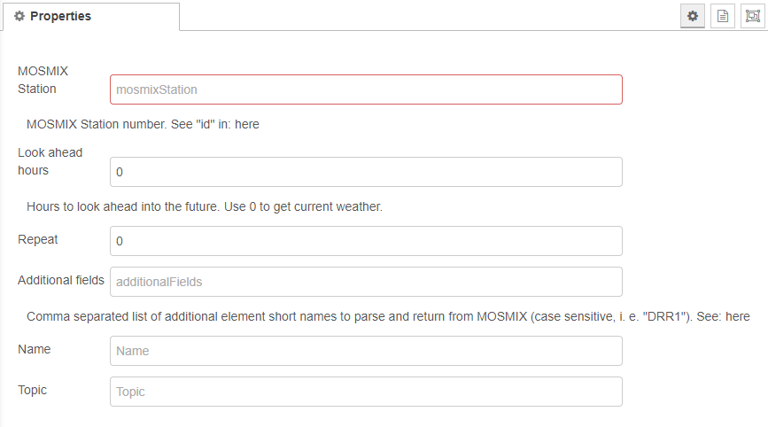

# node-red-contrib-dwd-local-weather

A node red node that returns German DWD MOSMIX current / forecasted weather for a given location.

It gives you the following data:
- Temperature in °C (in a 2 m height)
- Relative humidity in %
- Windspeed in m/s (in a 10 m height)
- Wind direction in degrees
- Rain probability in %
- Expected rain amount (precipitation) for the next 24 hours in kg/m2
- Timestamp of the forecast

  
**Fig. 1:** Node appearance

__Remark__: This node is mainly useful if you are interested in weather data for **Germany**.   International weather data is available for only a couple of **european locations** (see MOSMIX stations below). Examples for international locations are Bergen, London, Dublin, Brussels, Luzern, Lille, Locarno, Le Mans, Madrid, Ibiza, Klagenfurt (and many others).

The weather data is provided by DWD (Deutscher Wetterdienst, Frankfurter Straße 135, 63067 Offenbach).

References:
- https://isabel.dwd.de/DE/leistungen/opendata/opendata.html
- https://www.dwd.de/DE/leistungen/met_verfahren_mosmix/met_verfahren_mosmix.html
- https://www.dwd.de/DE/leistungen/met_verfahren_mosmix/faq/faq_mosmix_node.html
- https://www.dwd.de/DE/leistungen/opendata/help/schluessel_datenformate/kml/mosmix_elemente_pdf

## Installation

### In Node-RED (preferred)
* Via Manage Palette -> Search for "node-red-contrib-dwd-local-weather"

### In a shell
* go to the Node-RED installation folder, e.g.: `~/.node-red`
* run `npm install node-red-contrib-dwd-local-weather`

## Usage
The easiest usage of the node is using internal triggering:

  
**Fig. 2:** Basic node usage

In this example the node cyclically reads out the DWD data and emits it as an output `msg`.

### Node Configuration

  
**Fig. 3:** Node properties

Node configuration is quite simple. Only setting the property ***MOSMIX Station*** to select the required weather forecast location is mandatory.

#### MOSMIX station
Set this property to select the weather forecast location.  
The format is a 5 character ***id***. Allowed ids are given in the [stations catalog (in CFG file format)](https://www.dwd.de/DE/leistungen/met_verfahren_mosmix/mosmix_stationskatalog.cfg) of the DWD (german weather service): See coloumn 'id' and search for your location.

Examples:
- id = **10389** for Berlin, Alexanderplatz
- id = **K1174** for Heinsberg (NRW)
- id = **K4476** for Tirschenreuth (BY)

#### Look ahead Hours
Hours to look ahead into the future. Use 0 to get actual weather.

When you set *Look ahead hours*, the weather data returned will be for x hours in the future. If you look at the temperature for 12 hours ahead for example, you should see a different number returned unless that temperature happens to be exactly the same to the actual temperature.

Note: This configuration property is superseeded by an input `msg` with a  `msg.payload.lookAheadHours` element (see secion *Input* below).

#### Repeat
Automatic cyclic repeat (in seconds). If set to a value <> 0, the node automatically repeats the DWD data query and emits a `msg` telegram at its output.

Hint: Do not set this value too small to avoid unneccesary traffic. Appropriate repeat intervals are several minutes due to the weather data does not change at a higher rate than 15-20 seconds, typically one minute.

#### Additional fields
##### Basics
With the *Additional fields* property you can add further weather data to `msg.payload`.    
Possible elements can be selected from this [MOSMIX element list](https://www.dwd.de/DE/leistungen/opendata/help/schluessel_datenformate/kml/mosmix_elemente_pdf.html) from the DWD.  
Several elements can be selected and have to be comma-separated.

##### Example
The following figure shows the `msg.payload` structure of an example with "FF,FX1,SunD,SunD1,R101,Td,VV,W1W2,wwTd":

  
**Fig. 4:** *Additional fields* example `msg.payload` contents

Note that there may be values set to 'NaN' ("SunD" in the figure above) when evaluating these values.  
See also: Node issue ["NaN error with precipitation 24h and 3h"](https://github.com/c5te1n/node-red-contrib-dwd-local-weather/issues/18).

##### MOSMIX elements used by the node
The following MOSMIX elements are used as the basis for the node's `msg.payload` values:
- `payload.tempc`:  "TTT"
- `payload.humidity`: "Td" and "TTT"
- `payload.windspeed`: "FF"
- `payload.winddirection`: "DD"
- `payload.precipitation_perc`: "wwP"
- `payload.precipitationNext24h`: "RR1c"

#### Name
A name for the wheather location may be set via this property.

### Input
The node is triggered by any input `msg` with arbitrary contents.

If the input `msg` contains the element `msg.payload.lookAheadHours` its value superseeds the *Look ahead Hours* node configuration property.

### Outputs
The node emits a `msg` whenever it is triggered by an input `msg` or at the configured *Repeat* interval (see node configuration above).

The default `msg` attributes are:
* `payload.station` - Description (location) of the station
* `payload.tempc` - Temperature in °C
* `payload.humidity` -  Relative humidity
* `payload.windspeed` - Windspeed in m/s
* `payload.winddirection` - Winddirection in °
* `payload.precipitation_perc` - probability of rain in per cent (so a value of 4 means 4%)
* `payload.precipitationNext24h` - total precipitation in the next 24 hours in kg/m2
* `payload.forecast_dt` - epoch timestamp of the forecast
* `payload.precipitation%` - DEPRECATED, same as `payload.precipitation_perc`

## Examples

### Basic example

### Example using *Additional fields*

## License

Apache 2.0 (c) Christian Stein
